+++
date = '2025-09-10T18:21:01-06:00'
draft = false
showDate = true
title = "Internship with 3DEO&mdash;Pose Graph Optimization"
+++



*See [overview article](/posts/internship-3deo) and slides from my internship presentation on [GitHub](https://github.com/mward19/3deo-internship-presentation/tree/master).*

***
# Pose Graph Optimization

All lidar sensors function by shooting light at a target and timing how long the light takes to reflect back. Geiger-mode lidar is special in that it detects _individual photons_ returning to the sensor, making it especially good at seeing through partial cover, like forest canopies. When scanning from an airplane, most of the reflected photons still come from the leaves, but by scanning from multiple angles, you can gather enough data from the ground to clearly map the understory. Thus piecing together scans taken from different angles is a key step in processing Geiger-mode lidar data.

***
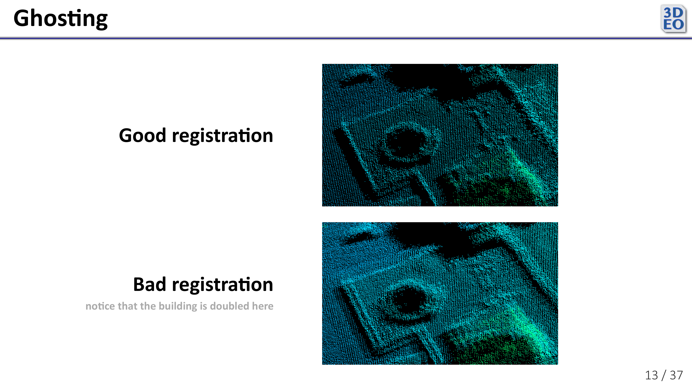

Since the sensor is equipped with plenty of tools to track its position and orientation in the sky, it is possible to identify where the source of each reflected photon lies in 3D space, and thus place a point for each photon in a point cloud... but those sensor measurements can drift between scans. If you put the scans together naively, using just the sensor position and orientation to determine the location of the source of each reflected photon, the scans appear misaligned in a phenomenon called _ghosting_.
***

Fortunately, we have more information to place the points besides sensor position and orientation measurements. We have _the points themselves_. Ghosting is easy for us to spot because we can see duplicate structures in the misaligned scans. Many algorithms exist to align a pair of scans based on this principle, like [Iterative Closest Point](https://en.wikipedia.org/wiki/Iterative_closest_point). (At the moment, 3DEO primarily uses a novel algorithm better suited to the properties of its data, since other algorithms like ICP tend to be too slow and complex.) Again, these algorithms serve only to align a pair of scans. How can one extend them to align \\(n > 2\\) scans?

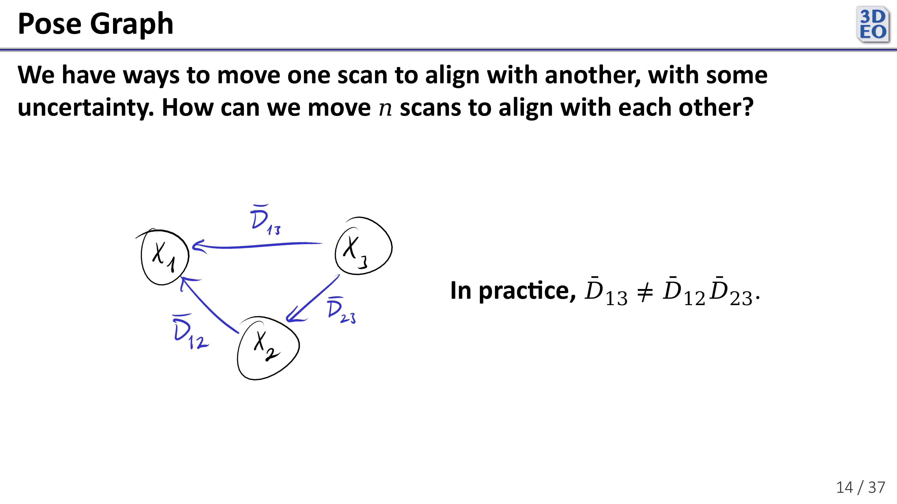

We can set this problem up as a _pose graph_, a [graph](https://en.wikipedia.org/wiki/Graph_(discrete_mathematics)) where each node (\\(X\_1, ..., X\_n\\)) represents the position of a scan relative to where it "belongs", and each edge (\\(\bar{D}\_{ij}, \ i, j \in \\{1, ..., n\\}\\), transformation from scan \\(j\\) to scan \\(i\\)) represents a pairwise alignment (also called a pairwise _registration_) derived from an algorithm like ICP. Some number of \\(\bar{D}\_{ij}\\) are known, and each \\(X\_i, \ i \in \\{1, ..., n\\}\\) is unknown. Now, one would hope that taking scan 3 and aligning with scan 1 would be equivalent to taking scan 3, aligning it with scan 2, and aligning that to scan 1, but in practice this is never the case since no pairwise registration algorithm is perfect. That is, we should expect that \\(\bar{D}\_{13} \neq \bar{D}\_{12} \bar{D}\_{23}.\\)
***

To determine the optimal pose of each scan (the value of each \\(X\_i\\)), we can imagine that each pairwise registration is a spring in the pose graph. Since poses are multidimensional, the "elasticity" of each spring is a covariance matrix \\(C\_\{ij\}\\), and the energy in each spring given a set of poses \\(X\_1, ..., X\_n\\) is the squared Mahalanobis distance \\((\bar{D}\_\{ij\} - (X\_i - X\_j))^T C_\{i j\}^\{-1\} (\bar{D}\_\{ij\} - (X\_i - X\_j))\\). The optimal poses minimize the sum of the energy in the springs. That is, we seek

\[
\underset{X_1, \ldots, X_n}{\argmin}
\,
\bigl(\bar{D}_{ij} - (X_i - X_j)\bigr)^{T}
C_{ij}^{-1}
\bigl(\bar{D}_{ij} - (X_i - X_j)\bigr)
\]

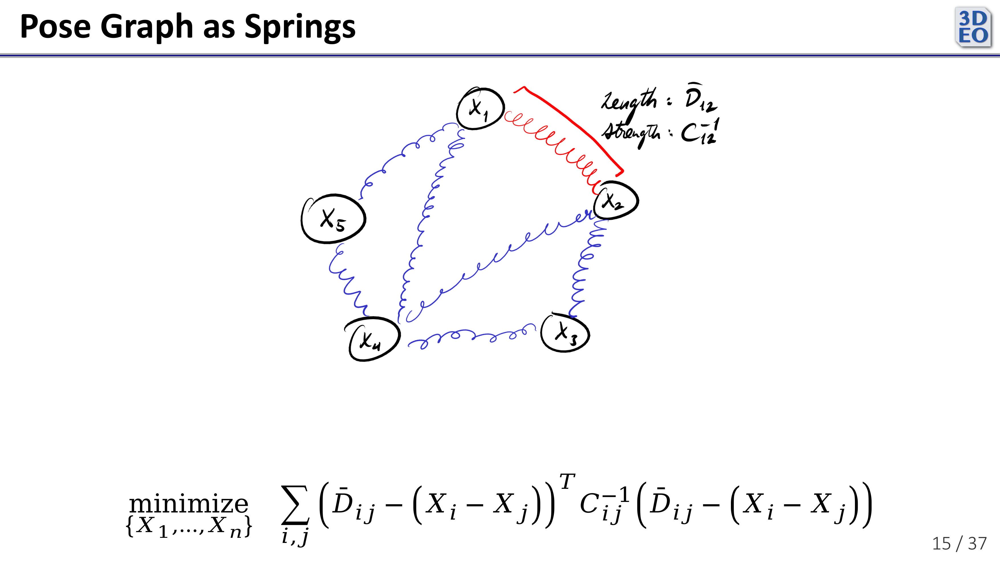

Similar problems arise in robotics, like [Simultaneous Localization and Mapping](https://en.wikipedia.org/wiki/Simultaneous_localization_and_mapping) (SLAM).

***
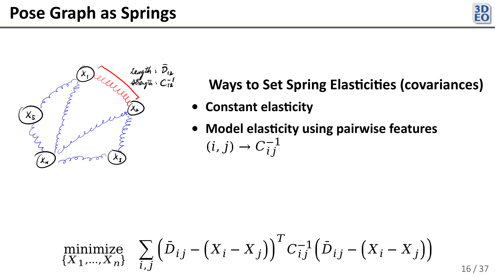

The trickiest part of the problem is deciding the covariance of each pairwise registration (the elasticity of each spring). One might let the covariance for each pairwise registration be the same, making each edge have the same "elasticity" in the pose graph. Alternatively, one might use features on each pairwise registration to determine the covariance. For example, if scans \\(i\\) and \\(j\\) didn't overlap very much, we might expect the pairwise registration between them \\(\bar{D}_{i j}\\) to have more error (a higher covariance). 

***
I implemented a registration optimizer using the closed-form least squares pose graph solution described by Lu and Milios in [Globally Consistent Range Scan Alignment for Environment Mapping](https://robotics.caltech.edu/~jerma/research_papers/scan_matching_papers/milios_globally_consistent.pdf).

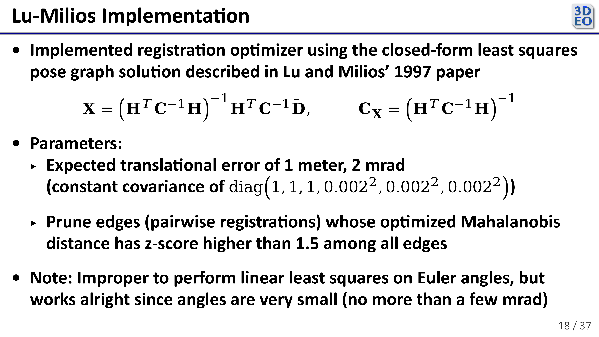

Because it gives a closed-form solution to the minimization problem described earlier, it is very fast. It can also handle non-constant pairwise covariances, which is important if you want to weight some pairwise registrations more than others.  (In my analysis, I fixed the covariances to encode an expected translational error of a meter and an expected rotational error in each axis of 2 mrad.)

Now, our point cloud registrations were 6 dimensional, with both translation and rotation components. The space of rotations is not linear, so it is improper to perform linear least squares in it. However, our angles were very small (no more than a few milliradians), so it still worked quite well.

***
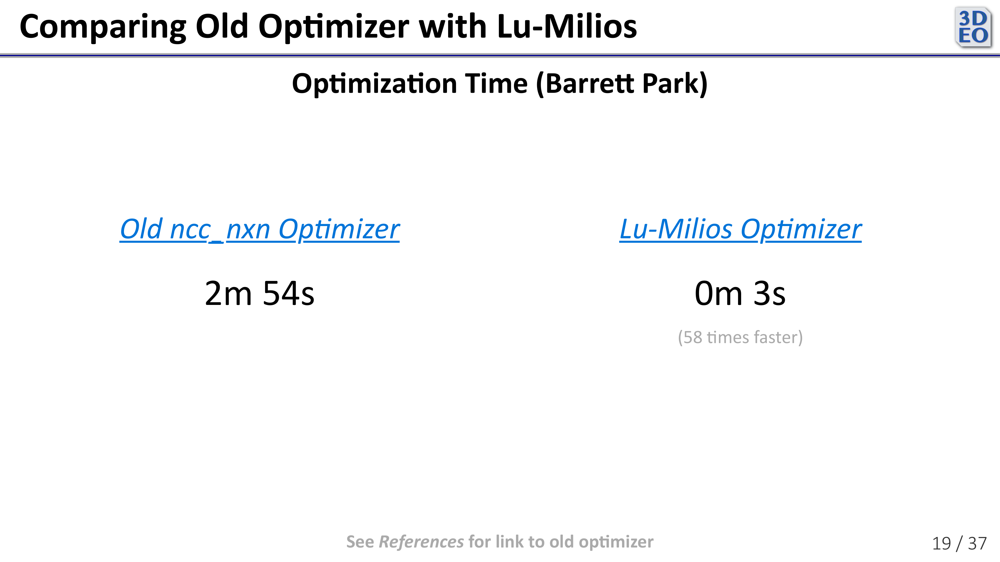

On a large dataset with over 200 scans, the Lu-Milios optimizer was 58 times faster than the old one (which was an iterative method, and not a closed-form solution to the pose graph problem).

***
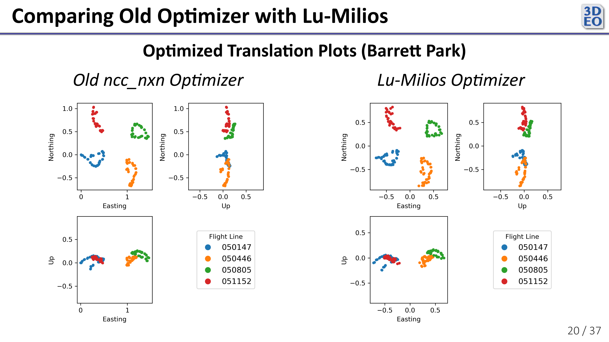

The translations my new optimizer gave were about the same as those of the old optimizer, validating its correctness. (Northing, Easting, and Up correspond to translations in the "x", "y", and "z" axes. Rotational components are not shown.)

***
The registrations from the new optimizer also looked similar visually.

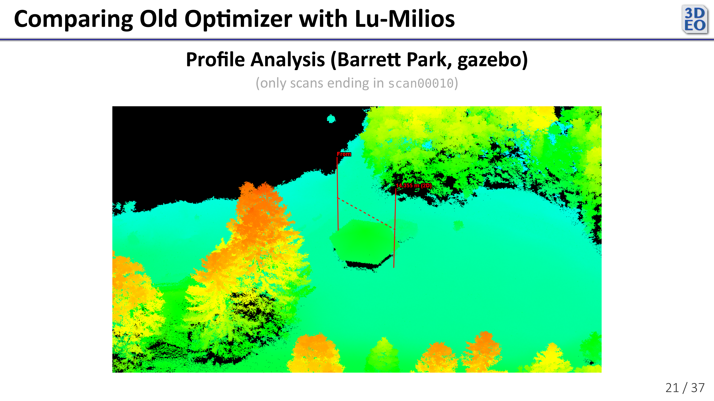
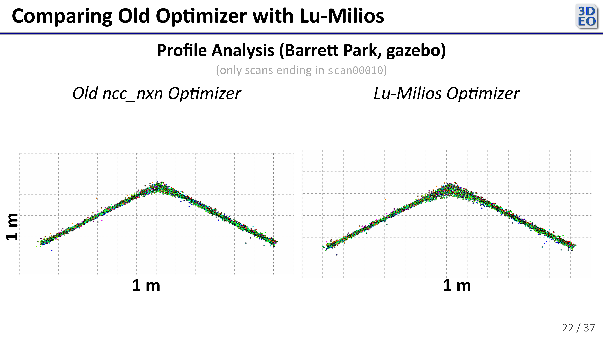

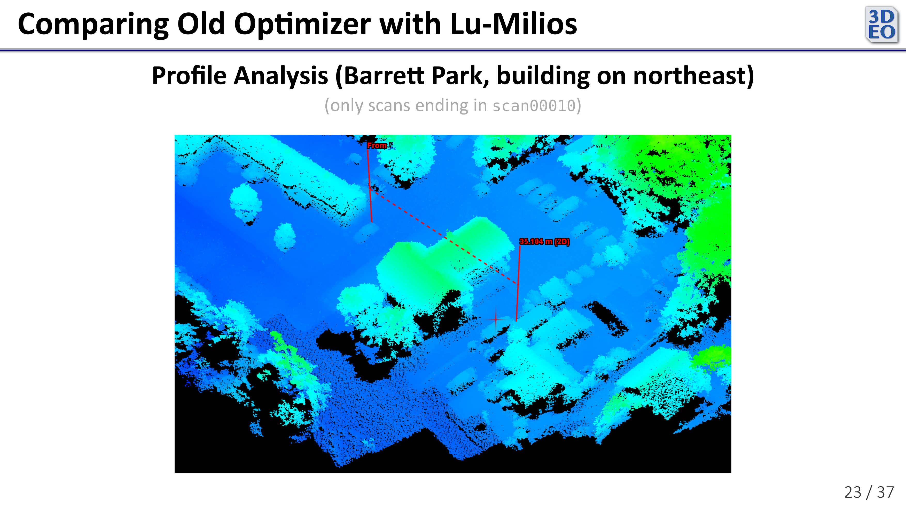
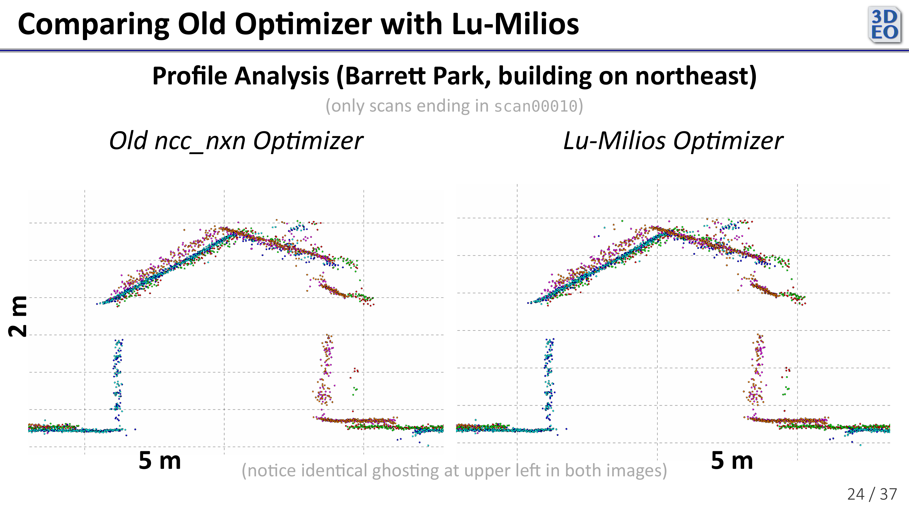

In the above plot we see some ghosting. Because both registration optimizers exhibited the same ghosting, we can conclude that the issue lies with the pairwise registrations themselves (the scans are probably a little warped and need a non-rigid transformation to come into perfect alignment).

***
The new optimizer was much faster while giving similar results to the old optimizer.

