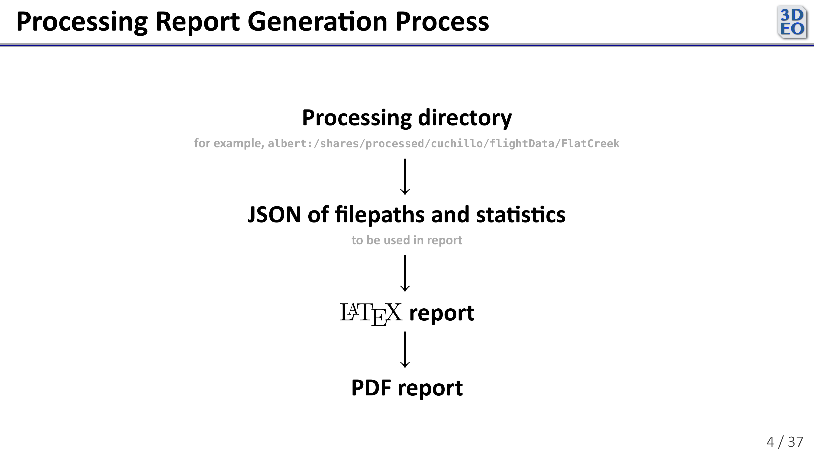
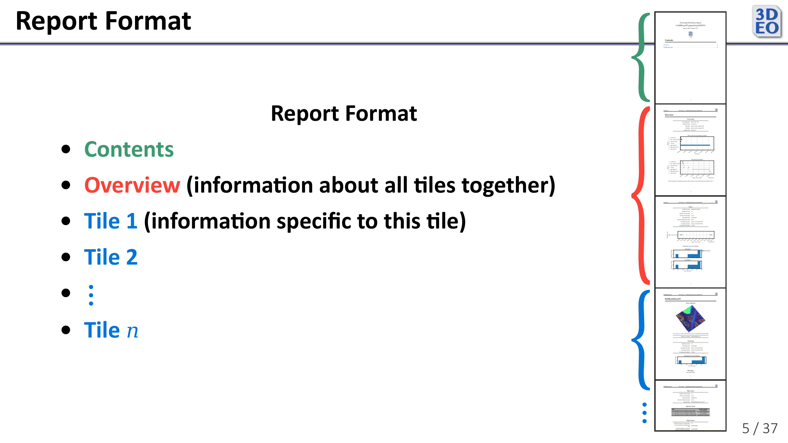
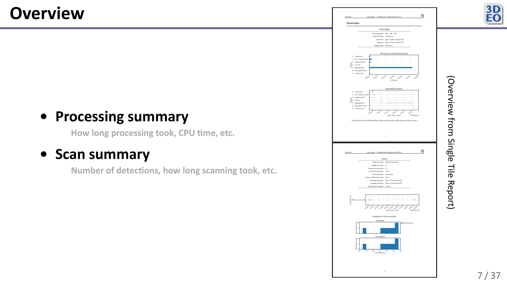
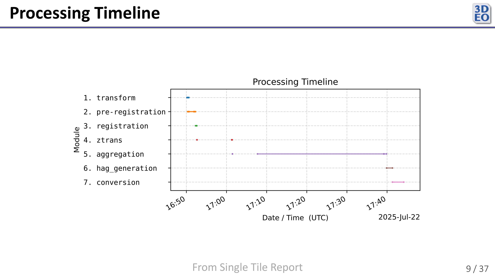
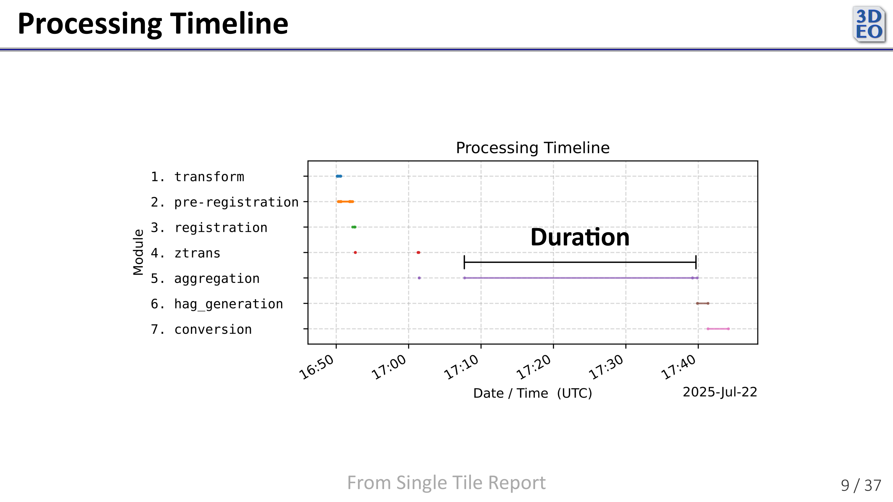
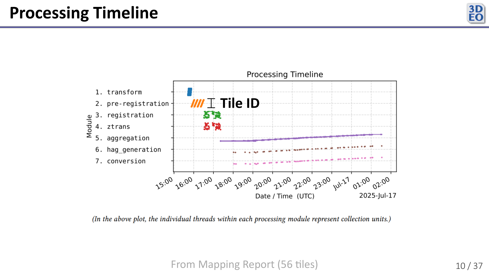

+++
date = '2025-09-10T18:21:03-06:00'
draft = false
showDate = true
title = "Internship with 3DEO&mdash;Processing Performance Report"
+++



*See [overview article](/posts/internship-3deo) and slides from my internship presentation on [GitHub](https://github.com/mward19/3deo-internship-presentation/tree/master).*

*Also see example processing reports (from the time of my internship presentation, current reports contain further improvements): [Mapping Report](/other/processing_report_mapping.pdf), [Single Tile Report](/other/processing_report.pdf).*

***

# Processing Performance Report
After processing a batch of 3DEO lidar data, it is not immediately obvious how well processing went. To find and diagnose problems, one might have to parse through a SQL database with thousands of Slurm jobs, download and view hundreds of large, unwieldy point clouds, parse program log files, locate and interpret plots output at various stages of processing, and more. It is also useful to know how long the various stages of processing took in order to know which stages need further optimization. To more easily fetch that kind of diagnostic information, 3DEO asked me to write a processing stage to automatically generate human-readable processing performance reports.

***

I chose to generate the report in a few steps. First, my program collects data from processing outputs and the SQL database of Slurm jobs. Then it compiles that information into a large JSON, which it uses to populate fields in a number of \\(\LaTeX\\) templates I wrote. Finally, it generates a PDF from the \\(\LaTeX\\).

***

3DEO's processing pipeline is designed to handle both small and large amounts of data. As such, the report must be very flexible. Some reports are just a few pages, while others are longer than many college textbooks. 

***

The report begins with an overview of all processing performed in the run. It contains a number of useful visualizations focused on processing time, among other things.

***

One such visualization is the Processing Timeline. It shows how long in real time (as opposed to CPU time) each stage of processing took. 

Each thread shows how long one Slurm job took.

When processing multiple targets (tiles) simultaneously, the vertical axis (within each processing module row) indicates which target each Slurm job corresponds to. This helps visualize how many jobs were running concurrently at any given time.

***

The per-target (per-tile) sections of the report give lower-level information useful for evaluating how successful processing was for a given target. (3DEO's processing currently processes each target separately.) 

***

Here are a couple reports generated by the program as it was at the end of July:
- [Mapping Report](/other/processing_report_mapping.pdf)
- [Single Tile Report](/other/processing_report.pdf)

Since generating these reports, as far as I can remember (I don't have the code anymore), additions and changes to the report include:
- Removal of unimplemented fields (like those in the per-tile registration section)
- Reports on processing errors, both in the overview and the per-tile sections
- Improved formatting of tile images
- Report on versions of each processing module
- Per-tile processing timeline plot in each per-tile section

***

Writing the processing performance report program gave me a chance to dive into 3DEO's processing pipeline and understand the purpose of each step in it. For some of the statistics that the reports display, I had to modify the existing pipeline to report more information at the appropriate processing step (for example, report on data rejection as data is rejected throughout processing). I also learned more about the scripting and document typesetting side of \\(\LaTeX,\\) as opposed to just typesetting math.
