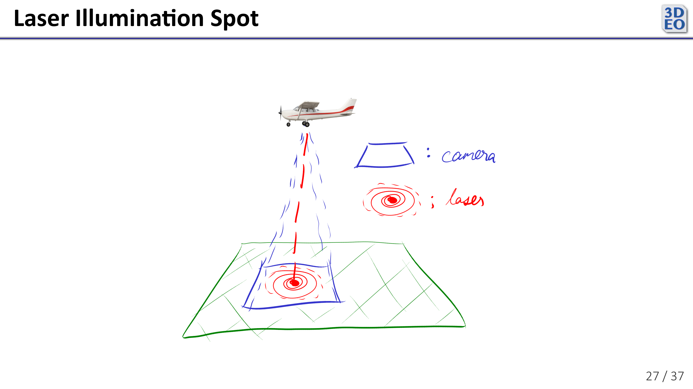
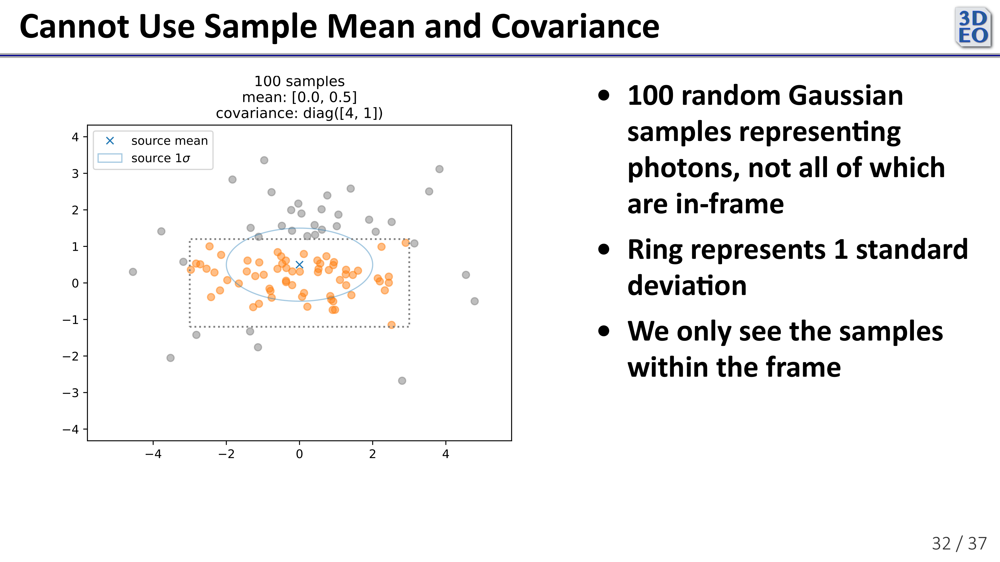
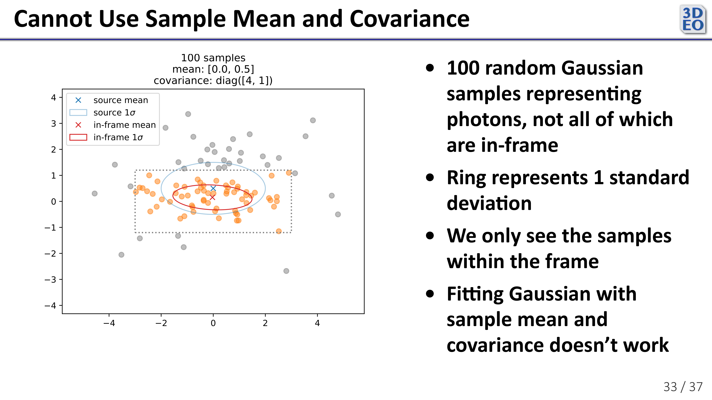

+++
date = '2025-09-13T23:31:02-06:00'
draft = false
showDate = true
title = "Internship with 3DEO&mdash;Illumination Spot Modeling"
+++



*See [3DEO internship overview](/posts/internship-3deo) and slides from my internship presentation on [GitHub](https://github.com/mward19/3deo-internship-presentation/tree/master).*

***

# Illumination Spot Modeling
During my internship at 3DEO this summer, I spent some time modeling the region of laser illumination throughout a scan as observed in camera space. That is, as represented in the image below, I modeled the red spot on the ground (the laser illumination spot) relative to the blue region (the camera field of view).

Much of the work in designing and building a 3DEO lidar sensor goes into controlling the mirrors and lenses that guide the sensor's laser to the target and back into the camera. The mirrors in the sensor oscillate very quickly to scan a target, so it is just about impossible to align them perfectly throughout a scan. Ideally, the region illuminated by the laser reflects right back into the middle of the camera's sensor array, as in the image above. In practice, the light reflected from the laser illumination spot occasionally veers away from the middle of the camera, leading to less efficient data collection.

***
<video controls autoplay loop muted>
    <source src="/video/hitmap_moving_average_window_100_slow.mp4" type="video/mp4">
    <!-- <source src="/video/hitmap_moving_average_window_100_slow.webm" type="video/webm"> -->
    Your browser does not support the video tag.
</video>
This video shows a laser illumination spot as detected by the camera throughout a particular scan. The video is slowed down substantially&mdash;the entire scan was collected in a second or two of real time.

Notice that there are a few dead pixels, and that the spot moves up and down in the camera frame.

My project was to model this spot throughout a scan in order to potentially:
- Generate more accurate pointwise reflectivity (how reflective a spot on the ground is) estimates
- Validate or refine alignment of the mirrors and other lidar sensor devices in-flight
- Track defective pixels

***

I chose to model the spot as a single 2-dimensional Gaussian with a mean and covariance that can change throughout the scan. To get a baseline I began by fitting my Gaussian by taking the sample mean and covariance of the pixel positions. That doesn't work very well though. To illustrate why, consider the following simulated data.

In the above plot, the dotted gray box represents the simulated camera frame and each point represents a "photon detection". The true distribution is represented in blue. The "camera" only detects the orange points, since the rest are out of its field of view. If we try to take the sample mean and covariance...

we're way off, as shown in red. This is precisely the phenomenon I saw when I tried to take the sample mean and covariance of the real data&mdash;a shrunken covariance and a mean biased towards the center of the camera frame.

***

Since that didn't work, I also tried fitting a truncated 2-dimensional Gaussian to the data with Bayesian inference (using PyMC). It was a lot of fun, but found that one of the tools I needed [wasn't yet implemented](https://discourse.pymc.io/t/truncated-multivariate-normal-likelihood/17032).

***

As I dug into this problem, I found that some Princeton astronomers had faced the same challenge while fitting Gaussian Mixture Models to images of galaxies. They made some extensions to Expectation Maximization (the standard algorithm for fitting GMMs) in order to handle incomplete data like mine ([paper](https://arxiv.org/abs/1611.05806)). I applied their code, [a Python library called pygmmis](https://github.com/pmelchior/pygmmis), to my problem and it fit very nicely.

<video controls autoplay loop muted>
    <source src="/video/spot_movement_window_100_gaussians_1_new_gmmis_1_in_1_slow.mp4" type="video/mp4">
    <!-- <source src="/video/hitmap_moving_average_window_100_slow.webm" type="video/webm"> -->
    Your browser does not support the video tag.
</video>

Its runtime was too slow for real-time use, though. For this problem it functions well as a ground truth. I worked on faster alternatives, like fitting the covariance less frequently and using the brightest region of the spot to find the mean. I also found that throwing out large proportions of the photon detections before fitting with pygmmis worked quite well, speeding up the process significantly without sacrificing much accuracy.

Next, I would:
- Continue exploring faster ways of fitting the Gaussian model, using pygmmis or equivalent as ground truth
- Test on more scans to check robustness
- Prototype a simple pointwise reflectivity estimate. This might look something like $$\text{reflectivity estimate} \propto \frac{\text{observed reflection intensity}}{\text{illumination intensity}}$$ where \\(\text{illumination intensity}\\) is inferred from the spot illumination model, and \\(\text{observed reflection intensity}\\) comes from the local density of the point cloud.

***

This project showed me how tricky it can be to model data that’s only partially observed. Simple approaches didn’t hold up well, but methods like pygmmis provided a useful reference point for what good fits look like. The main challenge now is finding faster approximations that are accurate enough to be practical. There’s still more to explore, but these first steps gave a clearer picture of the problem and some practical directions forward.